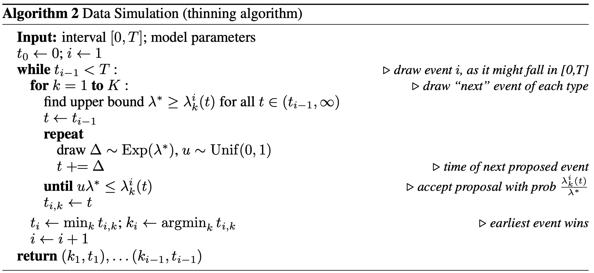

================================================
Thinning Algorithm for Sampling Event Sequences
================================================

EasyTPP's ``EventSampler`` implements the thinning procedure associated with
Algorithm 2 of `The Neural Hawkes Process: A Neurally Self-Modulating
Multivariate Point Process <https://arxiv.org/abs/1612.09328>`_. Its torch
implementation is in ``easy_tpp/model/thinning.py``.

Implementation
==============

``draw_next_time_one_step`` performs these operations for every history:

1. Evaluate total intensity at ``num_samples_boundary`` points and multiply
   the maximum by ``over_sample_rate`` to obtain a proposal-rate bound.
2. Draw ``num_exp`` exponential increments at that rate and apply
   ``torch.cumsum``. The resulting values are accumulated proposal times, not
   independent absolute times.
3. Evaluate the model's marked intensities at the proposal times and sum over
   marks.
4. Draw uniforms and accept the first proposal satisfying the thinning
   criterion.
5. If no proposal is accepted, return ``dtime_max`` for that sample. Average
   the ``num_sample`` draws with equal weights to predict the next interval.

After a time is sampled, the marked intensities at that time are normalized
over event types to predict the mark.

One-step and multi-step prediction
==================================

With a ``thinning`` block in ``model_config``, intensity-based models use
``BaseModel.predict_one_step_at_every_event`` for next-event prediction.
Set ``num_step_gen`` above 1 to activate recursive generation through
``BaseModel.predict_multi_step_since_last_event``.

As of 0.2.4, ``IntensityFree`` also provides the marked intensity required by
the shared sampler. For its log-normal-mixture inter-event distribution,

.. math::

   \lambda_k(t \mid \mathcal{H}) =
   \frac{f(t \mid \mathcal{H})}{S(t \mid \mathcal{H})}
   p(k \mid \mathcal{H}),

where ``f`` and ``S`` are the mixture density and survival function. This
closed-form hazard resolves generation support tracked in issue #13. The
model's optimized one-step override samples the mixture distribution directly;
its recursive multi-step path uses the hazard through the thinning sampler.

Multi-step generation supports right-padded batches with different sequence
lengths. It computes each row's true length from the non-padding mask, groups
rows by that length, removes padding, and generates after the last real event.

.. code-block:: yaml

    thinning:
      num_sample: 1
      num_exp: 500
      over_sample_rate: 5
      num_samples_boundary: 5
      dtime_max: 5
      patience_counter: 5
      num_step_gen: 5
